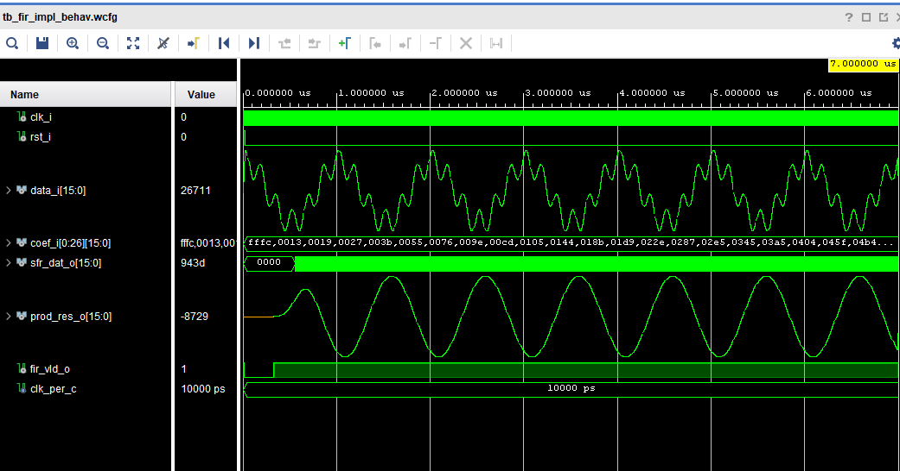

# Module 01: Folded Symmetric FIR Filter

Detailed hardware specification, register-level pipeline alignment, and time-division folding architecture for the DSP48E1 FIR engine.

---

## Architectural Overview

This module demonstrates the step-by-step evolution of a high-performance FIR filter target on AMD/Xilinx Zynq-7000 (-1 speed grade) silicon, migrating from a fully parallel systolic array to a 5x time-division folded architecture.

### Module Progression Milestones

1. **Milestone 1 (Parallel Baseline):** 54-tap symmetric FIR using direct DSP48E1 macro cascades (`AREG/ADREG = 1`, `BREG = 2`).
2. **Milestone 2 (Target Scaling):** Scaled 50-tap symmetric filter topology.
3. **Milestone 3 (Time-Division Folding):** 5x folded architecture utilizing 5 DSP48E1 slices with full timing closure.
4. **Milestone 4 (System Integration):** Dual-channel (I/Q) top-level system wrapper.

---

## Hardware Specifications & Latency Paths

| Parameter | Value / Setting | Description |
| :--- | :--- | :--- |
| **Target Primitive** | `DSP48E1` | AMD/Xilinx 7-Series DSP Slice |
| **Target Device** | `xc7z020clg400-1` | Zynq-7000 (Speed Grade -1) |
| **HDL Standard** | VHDL | Direct macro instantiations |
| **Pipeline Registers** | `AREG = 1`, `BREG = 2`, `PREG = 1` | Maximizes internal systolic clock frequency |
| **Accumulator Latency** | 3 Cycles | Synchronized with `OPMODE` / `ALUMODE` pipeline delays |

---

## Simulation & Verification

The testbench (`tb_fir_impl`) validates the timing closure and numerical behavior of the folded FIR filter implementation.

### Waveform Configuration
* The pre-configured waveform layout is saved in `sim/tb_range_detector.wcfg`.
* Running the project creation script (`scripts/fir_script.tcl`) automatically links this `.wcfg` file to the `sim_1` fileset in Vivado.

### Waveform Output


* **Key Signals Handled:** Clock cycle counter (`cyc_ctr_s`), pipeline delay stages, and DSP48E1 `OPMODE` decoding outputs.

---

## Directory Structure

```text
01_folded_fir/
├── docs/                 # Documentation assets & verification snapshots
├── hdl/                  # VHDL RTL sources & DSP wrappers
├── scripts/              # Project generation (fir_script.tcl, runme.bat)
├── sim/                  # Testbenches, .wcfg layouts & test vectors
└── README.md             # Hardware architectural specification